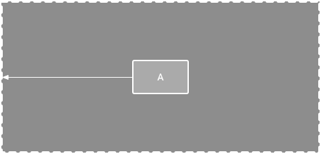

# Constraint layout
- lets you create large, complex layouts with a flat view hierarchy—no nested view groups
- all views are laid out according to relationships between sibling views and the parent layout

## Constraints
- to define a view's position you need to add at least one horizontal and one vertical constraint
- each constraint represents a connection or alignment to another view, the parent layout, or an invisible guideline
- if a view has no constraints when you run your layout on a device, it is drawn at position [0,0] (the top-left corner)

### Positions
1. parent position
   - constrain the side of a view to the corresponding edge of the layout
   
   

2. order position
   - define the order of appearance for two views, either vertically or horizontally
   
   

3. alignment
   - align the edge of a view to the same edge of another view
   - you can offset the alignment by dragging the view inward from the constraint
   
   
   
4. baseline alignment
   - align the text baseline of a view to the text baseline of another view
   
   
5. constrain to a guideline
   - you can add a vertical or horizontal guideline that lets you constrain your views and is invisible to your app's users
   
   
6. constrain to a barrier
   - similar to a guideline, a barrier is an invisible line that you can constrain views to
   - barrier doesn't define its own position, the position of a barrier moves based on the position of views contained within it (when you want to constrain a view to a set of views rather than to one specific view)
   
   

## Adjust the constraint bias
when you add a constraint to both sides of a view, and the view size for the same dimension is either "fixed" or "wrap content", the view becomes centered between the two constraints with a bias of 50% by default, you can adjust the bias:
```
app:layout_constraintHorizontal_bias="1" to place it at the end of the constraint
app:layout_constraintHorizontal_bias="0" to place it at the beginning of the constraint
app:layout_constraintHorizontal_bias="0.33" to place it on/third of the space from the begining of the constraint
```

## Adjust the view size
- Fixed: specify a specific dimension in the following text box or by resizing the view in the editor
- Wrap Content: the view expands only as much as needed to fit its contents
- Match Constraints: the view expands as much as possible to meet the constraints on each side, after accounting for the view's margins
### Set size as a ratio
- Aspect ratio is the term used to describe the dimensions of a view by comparing the width to the height and expressing it in ratio form. 
- The aspect ratio is a measured according to width:height, if the aspect ratio is 4:3, the width should be 4, whereas the height should be 3

When using the constraintDimensionRatio attribute, we need to have at least one constrained dimension set to 0dp, we need to set the attribute layout_constraintDimensionRatio to the required ratio
```
<Button 
    android:layout_width="wrap_content"
    android:layout_height="0dp"
    app:layout_constraintDimensionRatio="1:1"/>
```
   - set the height of the button to be the same as the width.

We can also use a ratio if both dimensions are set to 0dp. In this case, the system sets the largest dimensions that satisfy all the constraints mentioned while maintaining the given aspect ratio.
```
 <ImageView
        android:layout_width="0dp"
        android:layout_height="0dp"
        android:src="@drawable/sample_4"
        app:layout_constraintDimensionRatio="16:9"
        app:layout_constraintTop_toTopOf="parent"
        app:layout_constraintStart_toStartOf="parent"
        app:layout_constraintEnd_toEndOf="parent"/>
```
### Appending a Ratio With ‘W’ or ‘H’
To constrain one specific side based on the dimensions of another, we can preappend W or H to constrain the width or height
```
<ImageView
    android:layout_width="0dp"
    android:layout_height="0dp"
    android:id="@+id/imageView"
    app:layout_constraintBottom_toBottomOf="parent"
    app:layout_constraintRight_toRightOf="parent"
    app:layout_constraintLeft_toLeftOf="parent"
    app:layout_constraintTop_toTopOf="parent"
    app:layout_constraintDimensionRatio="W,1:3" />
```
### Setting Different Ratios for Different Screens: 
- to set the image aspect ratio change based on the device dimensions, refer to section_image_ratio from the resources
```
<string name="section_image_ratio">12:8</string>
```

## Control linear groups with a chain
- Chain is a group of views that are linked to each other with bi-directional position constraints
- The views within a chain can be distributed either vertically or horizontally

Chains can be styled in one of the following ways:
1. Spread 
   - the views are evenly distributed after margins are accounted for, this is the default
2. Spread inside
   - the first and last views are affixed to the constraints on each end of the chain, and the rest are evenly distributed.
3. Weighted
   - the space is evenly distributed between each view that's set to "match constraints," but you can assign a weight of importance to each view using the layout_constraintHorizontal_weight and layout_constraintVertical_weight attributes. This works the same way as layout_weight in a linear layout: the view with the highest weight value gets the most space, and views that have the same weight get the same amount of space
4. Packed
   - the views are packed together after margins are accounted for. You can adjust the whole chain's bias—left or right, or up or down—by changing the chain's "head" view bias


