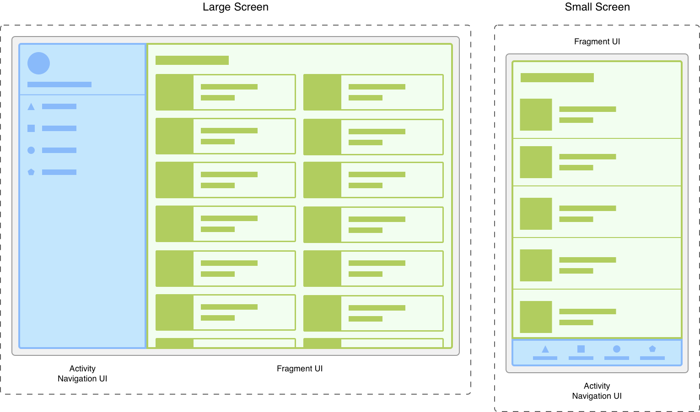

# Fragments

- a reusable portion of your app's UI
- defines and manages its own layout
- has its own lifecycle
- can handle its own input events
- can't live on their own, must be hosted by an activity or another fragment
- fragment’s view hierarchy becomes part of, or attaches to, the host’s view hierarchy.
- a modular portion of the user interface within an activity

### Modularity
- letting you divide the UI into discrete chunks
- fragments are better suited to define and manage the UI of a single screen or portion of a screen

Managing an app that responds differently to various screen sizes in the activity is unwieldy. Separating the navigation elements from the content can make this process more manageable. The activity is then responsible for displaying the correct navigation UI, while the fragment displays the list with the proper layout

Dividing your UI into fragments makes it easier to modify your activity's appearance at runtime. While your activity is in the STARTED lifecycle state or higher, fragments can be added, replaced, or removed. And you can keep a record of these changes in a back stack that is managed by the activity, so that the changes can be reversed.

 
 
## Create a fragment
   - minimal fragment that defines its own layout

   ```
   class ExampleFragment : Fragment(R.layout.example_fragment)
   ```
   1. Add a fragment via XML
      - use a FragmentContainerView element

```
    <androidx.fragment.app.FragmentContainerView
    xmlns:android="http://schemas.android.com/apk/res/android"
    android:id="@+id/fragment_container_view"
    android:layout_width="match_parent"
    android:layout_height="match_parent"
    android:name="com.example.ExampleFragment" />
```
   - the android:name attribute specifies the class name of the Fragment to instantiate
   - when the activity's layout is inflated, the specified fragment is instantiated
   - onInflate() is called on the newly instantiated fragment
   - a FragmentTransaction is created to add the fragment to the FragmentManager

   2. Add a fragment programmatically
      - the layout should include a FragmentContainerView to serve as a fragment container
``` 
   <androidx.fragment.app.FragmentContainerView
   xmlns:android="http://schemas.android.com/apk/res/android"
   android:id="@+id/fragment_container_view"
   android:layout_width="match_parent"
   android:layout_height="match_parent" />
```

- no specific fragment is automatically instantiated. Instead, a FragmentTransaction is used to instantiate a fragment and add it to the activity's layout
- in your FragmentActivity, you can get an instance of the FragmentManager, which can be used to create a FragmentTransaction
- you can instantiate your fragment within your activity's onCreate() method using FragmentTransaction.add(), passing in the ViewGroup ID of the container in your layout and the fragment class you want to add and then commit the transaction
```
class ExampleActivity : AppCompatActivity(R.layout.example_activity) {
    override fun onCreate(savedInstanceState: Bundle?) {
        super.onCreate(savedInstanceState)
        if (savedInstanceState == null) {
            supportFragmentManager.commit {
                setReorderingAllowed(true)
                add<ExampleFragment>(R.id.fragment_container_view)
            }
        }
    }
}
```
- fragment transaction is only created when savedInstanceState is null. This is to ensure that the fragment is added only once, when the activity is first created.
- when a configuration change occurs and the activity is recreated, savedInstanceState is no longer null, and the fragment does not need to be added a second time, as the fragment is automatically restored from the savedInstanceState
- If your fragment requires some initial data, arguments can be passed to your fragment by providing a Bundle in the call to FragmentTransaction.add()
#### Specialized fragment base classes
1. DialogFragment
   - displays a floating dialog
   - fragments automatically handle the creation and cleanup of the Dialog
2. PreferenceFragmentCompat
   - displays a hierarchy of Preference objects as a list
   - can be used to create a settings screen for your app

## Fragment manager
- fragmentManager is the class responsible for performing actions on your app's fragments, such as adding, removing, or replacing them and adding them to the back stack

Only one FragmentManager can control the fragment back stack at any given time.

To define the primary navigation fragment inside of a fragment transaction, call the setPrimaryNavigationFragment() method on the transaction, passing in the instance of the fragment whose childFragmentManager has primary control.
#### Access the FragmentManager
- You can access the FragmentManager from an activity or from a fragment.

FragmentActivity and its subclasses, have access to the FragmentManager through the getSupportFragmentManager() method.

You can get a reference to the FragmentManager that manages the fragment's children through getChildFragmentManager(). If you need to access its host FragmentManager, you can use getParentFragmentManager().

You can think about each host as having a FragmentManager associated with it that manages its child fragments.


#### Child fragments
If you want to show multiple fragments at once, such as in a split-view or a dashboard, you can use child fragments that are managed by your destination fragment and its child fragment manager.
other use cases:
- screen slides, using a ViewPager2 in a parent fragment to manage a series of child fragment views
- sub-navigation within a set of related screens
- jetpack Navigation uses child fragments as individual destinations. An activity hosts a single parent NavHostFragment and fills its space with different child destination fragments as users navigate through your app
- fragment's lifecycle state can never be greater than its parent. For example, a parent fragment or activity must be started before its child fragments. Likewise, child fragments must be stopped before their parent fragment or activity
#### Find an existing fragment
You can get a reference to the current fragment within a layout container by using findFragmentById(). Use it to look up a fragment either by the given ID when inflated from XML or by the container ID when added in a FragmentTransaction
#### Support multiple back stacks
- fragmentManager lets you support multiple back stacks with the saveBackStack() and restoreBackStack() methods
- saveBackStack() saves the state of all fragments in the popped transactions
#### Provide dependencies to your fragments
FragmentManager uses a FragmentFactory that the framework provides to instantiate a new instance of your fragment. This default factory uses reflection to find and invoke a no-argument constructor for your fragment. This means that you can't use this default factory to provide dependencies to your fragment.
You can then override the default factory of the FragmentManager with your custom factory, which is then used to instantiate your fragments.
## Fragment transactions
- to display a fragment within a layout container, use the FragmentManager to create a FragmentTransaction. Within the transaction, you can then perform an add() or replace() operation on the container
- you can save each transaction to a back stack managed by the FragmentManager, allowing the user to navigate backward through the fragment changes
- you can get an instance of FragmentTransaction from the FragmentManager by calling beginTransaction()
- the final call on each FragmentTransaction must commit the transaction. The commit() call signals to the FragmentManager that all operations have been added to the transaction
- Each FragmentTransaction should use setReorderingAllowed(true):

#### Adding and removing fragments

To add a fragment to a FragmentManager, call add() on the transaction, the added fragment is moved to the RESUMED state.
To remove a fragment from the host, call remove(), The removed fragment is moved to the DESTROYED state.
Use replace() to replace an existing fragment in a container with an instance of a new fragment class that you provide

```
// Create new fragment
val fragmentManager = // ...

// Create and commit a new transaction
fragmentManager.commit {
    setReorderingAllowed(true)
    // Replace whatever is in the fragment_container view with this fragment
    replace<ExampleFragment>(R.id.fragment_container)
}
```

- by default, the changes made in a FragmentTransaction are not added to the back stack. To save those changes, you can call addToBackStack() on the FragmentTransaction

#### Limit the fragment's lifecycle
When creating a FragmentTransaction, setMaxLifecycle() sets a maximum state for the given fragment 
- example; ViewPager2 uses setMaxLifecycle() to limit the off-screen fragments to the STARTED state

#### Showing and hiding fragment's views
FragmentTransaction methods show() and hide() set the visibility of the fragment's views without affecting the lifecycle of the fragment

#### Attaching and detaching fragments
- the detach() method detaches the fragment from the UI, destroying its view hierarchy. The fragment remains in the same state (STOPPED) as when it is put on the back stack.
- The attach() method reattaches a fragment from which it was previously detached. This causes its view hierarchy to be recreated, attached to the UI, and displayed.

## Fragment lifecycle
- fragment implements LifecycleOwner, exposing a Lifecycle object that you can access through the getLifecycle() method

Each possible Lifecycle state is represented in the Lifecycle.State enum
- INITIALIZED
- CREATED
- STARTED
- RESUMED
- DESTROYED

By building Fragment on top of Lifecycle, you can use the techniques and classes available for Handling Lifecycles with Lifecycle-Aware Components.

As an alternative to using a LifecycleObserver, the Fragment class includes callback methods that correspond to each of the changes in a fragment's lifecycle. 

When a fragment is instantiated, it begins in the INITIALIZED state. For a fragment to transition through the rest of its lifecycle, it must be added to a FragmentManager, FragmentManager is also responsible for attaching fragments to their host activity and detaching them when the fragment is no longer in use.
1. the onAttach() callback
   - invoked when the fragment has been added to a FragmentManager and is attached to its host activity
   - the fragment is active, and the FragmentManager is managing its lifecycle state
   - always called before any Lifecycle state changes

2. The onDetach() callback 
   - invoked when the fragment has been removed from a FragmentManager and is detached from its host activity
   - the fragment is no longer active and can no longer be retrieved using findFragmentById()
   - always called after any Lifecycle state changes

(unrelated to the FragmentTransaction methods attach() and detach())

#### Fragment lifecycle states and callbacks


When moving upward through its lifecycle states, a fragment first calls the associated lifecycle callback for its new state. Once this callback is finished, the relevant Lifecycle.Event is emitted to observers by the fragment's Lifecycle.

**fragment CREATED**

- your fragment has been added to a FragmentManager and the onAttach() method has already been called, fragment's view has not been created at this time.
- invokes the onCreate() callback, the callback receives a savedInstanceState Bundle argument containing any state previously saved by onSaveInstanceState()

**Fragment CREATED and View INITIALIZED**

- the fragment's view Lifecycle is created only when your Fragment provides a valid View instance. In most cases, you can use the fragment constructors that take a @LayoutId, which automatically inflates the view at the appropriate time, override onCreateView() to programmatically inflate or create your fragment's view
- if your fragment's view is instantiated with a non-null View, that View is set on the fragment and can be retrieved using getView()

# TODO