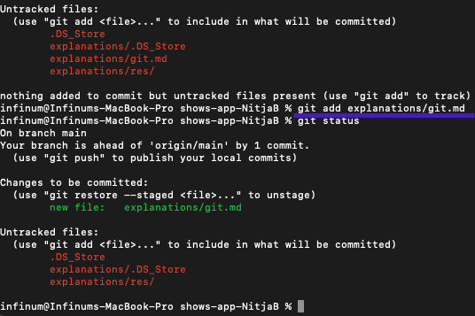

# Version control
   - version control is a system that records changes to a file or set of files over time so that you can recall specific versions later.

## Git
   - tool for version control
   - stores data like a series of snapshots of a miniature filesystem, every time you commit it git saves the state of project
   - git can choose between 2 types of saving depending if a file has changed:
      1. file hasn't changed - it will reference file which represents that file last time it changed
      2. file has changed - it will save new file and take it's reference

   


   - it uses SHA-1 hash to keep history integrity, every version has its own hash which is calculated by:
    1. hash of version before it
    2. hash of version calculated with that version file state

### Working directory info(```git status```)
   - writes on terminal information about working directory
      1.  branch name
      2.  files with modified/staged states
      3.  new files
      4.  ...
   
      - e.g. 
            
      

### The Three States
   - it has 3 main states that your files be in:
      1. Modified - file changed but not committed
      2. Staged - file marked to go to you next commit snapshot 
      3. Committed  - data is safety stored in your local database
   - workflow
     

#### Staging
   1. move changed files form working directory (```git add```)
         
       1. Stage all changed files
          ```
          git add .
          ```
          - e.g. of use:
            
          
       2. stage specific changed file
          ```
          git add {file path}
          ```
          - e.g. of use:
         
          
       3. stage all changed files from specific directory
          ```
          git add {directory path}
          ```
          - e.g. of use:

            

   2.  Un-staging(```git restore --staged```)
       - un-stages files from working directory
       - same writing options as ```git add```
#### Committing(```git commit```)
   - saves staged files in database (makes an entry in history)
   - there are 2 main calls
      1. with -m parameter
         ```
         git commit -m "CommitPoruka"
         ```
         - creates commit with message in quotes
      2. without -m parameter
         ```
         git commit
         ```
         - opens up vim text editor where you can write commit message and its description
         - first line of file is commit message, its followed by line break which is followed by description
         - lines starting with ```#``` sign wont be saved to text file
         - e.g of commit vim file
          
         - in VIM you access menu by pressing ```ESC```
         - if you want to type press ```i``` which will start INSERT MODE
         - when you are done with typing go to Vim menu and type ```:wq``` (write + quit)
            